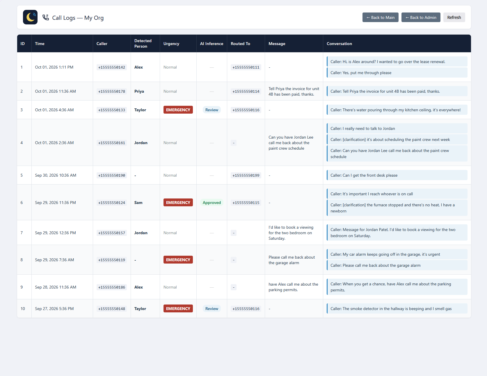
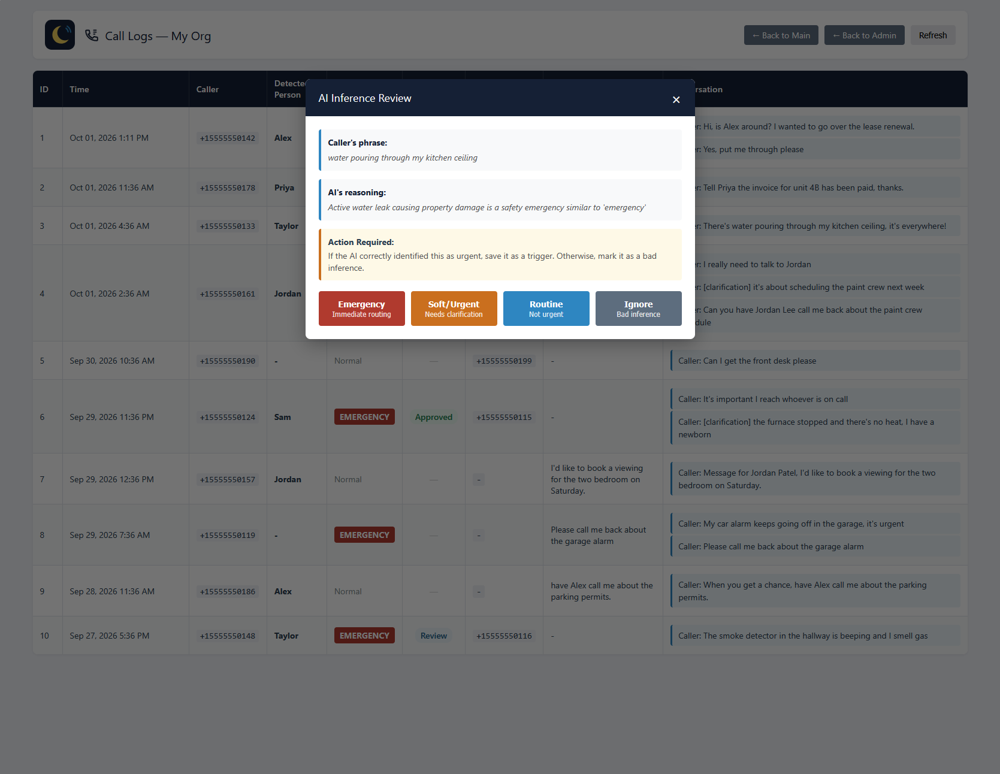
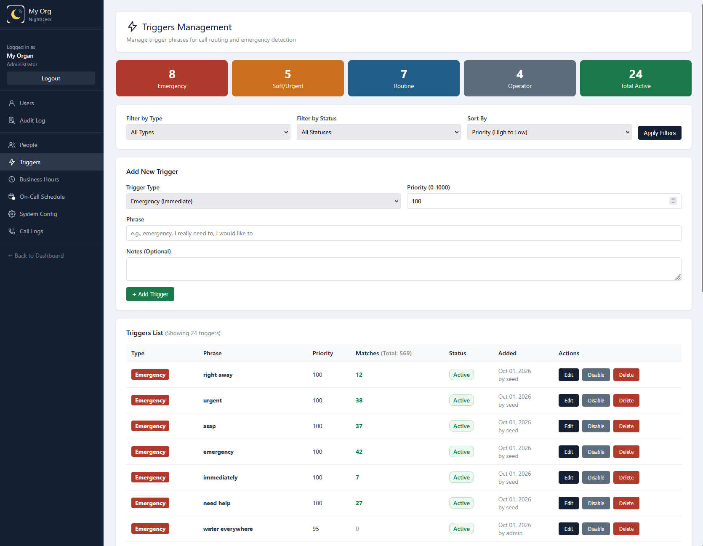
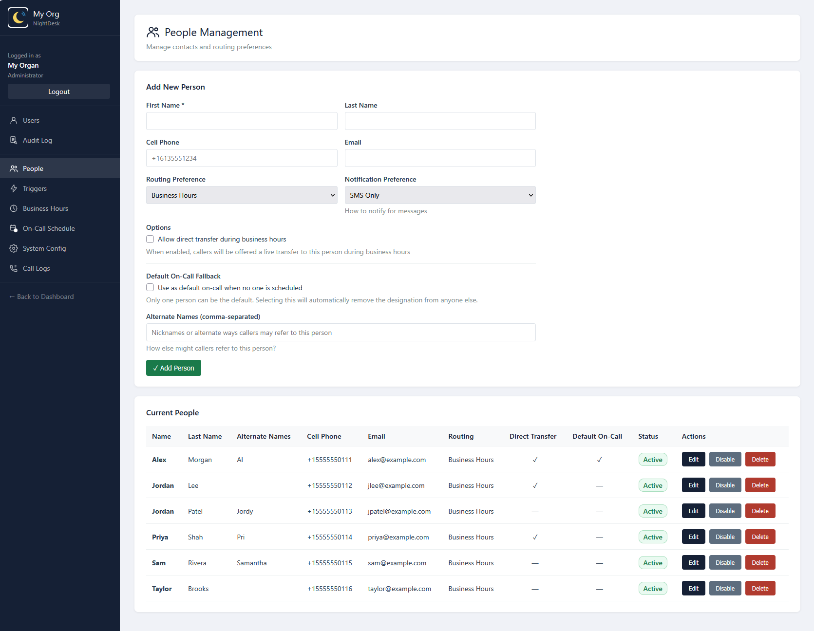
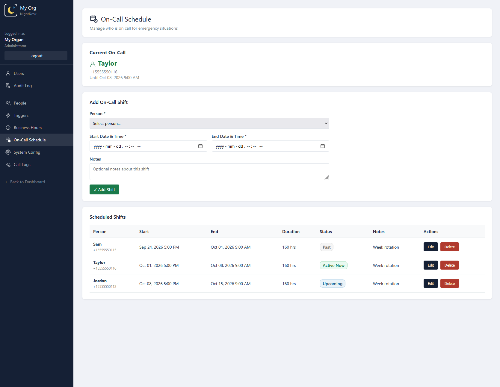

# NightDesk

**AI call sorting for small businesses: knows who callers want, how urgent it is, and who's on call.**

NightDesk answers your business line, listens to what the caller says, and decides what to do:

- **"Tell Sam I'll be late."** → takes the message and texts it to Sam.
- **"Can I talk to Sam?"** → offers to connect directly (business hours) or takes a message.
- **"I really need to reach Sam."** → asks *"What seems to be the problem?"* before deciding whether it's urgent.
- **"Our basement is flooding!"** → transfers immediately, to the on-call person after hours.

Everything callers hear, and who gets reached when, is managed from a web admin panel. No code changes or restarts are needed.

### Screenshots

**Call logs.** Every call, with the caller's words, who it was for, and whether it was an emergency.


**Inference review.** When the AI decides a call is an emergency without hearing a trigger phrase, it explains why. One click turns a good call into a new trigger.


**Triggers.** The phrases that steer urgency, grouped by tier, with how often each one matched.


**People** and **on-call schedule.** Who callers can reach, how each person is notified, and who takes after-hours emergencies.



## How it works

```
Caller ──▶ Twilio ──webhook──▶ NightDesk (Node.js) ──▶ AI model
                                   │         ▲
                                   ▼         │
                               PostgreSQL ◀── Admin panel (PHP)
```

1. Twilio receives the call and posts to `/call/incoming`. NightDesk plays the business-hours or after-hours greeting and listens.
2. Twilio transcribes the caller's speech and posts it to `/call/gather`. NightDesk sends the transcript, your staff list and your trigger phrases to the AI model, which returns a routing decision as JSON.
3. NightDesk replies with TwiML: speak, listen again, transfer, or hang up. It logs the call and sends SMS notifications.

### Urgency tiers

Trigger phrases are stored in the database and tuned in the admin panel. The AI matches them exactly and by meaning, so "the pipes burst" counts as an emergency even if no trigger phrase was said.

| Tier | Example triggers | What happens |
|---|---|---|
| **Emergency** (HARD) | "emergency", "urgent", "right away" | Transfer now: named person → main line (open) → on-call person (closed) → text everyone + record a message |
| **Needs clarification** (SOFT) | "I really need to", "it's important" | Ask "What seems to be the problem?", then re-assess |
| **Routine** | "when you get a chance", "I would like to" | Take a message, even if the content sounds alarming |
| **Operator** | "operator", "front desk" | Skip the AI and go to the main line (optionally business hours only) |

### Routing preferences

Each person has a routing preference that decides how *routine* calls reach them:

| Preference | Open | Closed |
|---|---|---|
| **Business Hours** (default) | Offer to connect or take a message | Take a message |
| **Always Direct** | Connect straight away | Connect straight away |
| **Always Screen** | Offer to connect or take a message | Offer to connect or take a message |
| **Message Only** | Take a message | Take a message |

Emergencies for a named person connect to them directly, except **Message Only** people, who are never connected. Their emergencies go to the main line (open) or the on-call person (closed). Message Only people are also skipped when choosing who's on call.

Every AI-inferred emergency is logged with the model's reasoning, so you can review it and promote useful phrases to triggers.

## Requirements

- Node.js 18+
- PostgreSQL 13+
- A [Twilio](https://www.twilio.com/) account with a voice-capable phone number
- An [Anthropic API](https://console.anthropic.com/) key
- A public HTTPS URL for Twilio webhooks: your own domain behind a reverse proxy, or [ngrok](https://ngrok.com/) for development
- PHP 8 with the `pgsql` extension, for the admin panel

## Setup

```bash
git clone https://github.com/<you>/nightdesk.git
cd nightdesk
npm install

# Database
createdb nightdesk
psql -d nightdesk -f db/schema.sql
psql -d nightdesk -f db/seed.sql

# Configuration
cp .env.example .env     # then fill in your keys and database credentials
npm start
```

Then:

1. Set your phone numbers. In `system_config`, or later in the admin panel, change `inbound_number` to your Twilio number and `main_line_number` to the staffed line that operator requests and fallbacks go to.
2. Point Twilio at NightDesk. In the Twilio console, open your phone number and set:
   - **A call comes in:** `https://<your-host>/call/incoming` (HTTP POST)
   - **Call status changes:** `https://<your-host>/call/status` (HTTP POST)
3. Open the admin panel. The first visit shows a one-time setup page, where you create the administrator account and set your organization's name, logo and colors. Setup locks itself after it completes.
4. Add people in the admin panel: names, nicknames, cell numbers, and whether they accept direct transfers.

### Admin panel

The admin panel in `admin/` is plain PHP. Serve that directory as the web root (see `deploy/apache-vhost.conf.example`), or try it locally with `php -S localhost:8080 -t admin`.

It reads its database settings from the same `.env`, one directory above `admin/`. The web server user must be able to read that file. If you keep `.env` elsewhere, point to it with `SetEnv NIGHTDESK_ENV /path/to/.env` in the vhost.

Organization name, logo and colors are set during first-run setup and can be changed any time on the **Branding** page (admins only). Uploaded logos are saved in `admin/images/uploads/`, which the web server user must be able to write to.

### Local development with ngrok

```bash
ngrok http 3000
# .env: TUNNEL_MODE=ngrok  (ngrok's free fixed domain keeps signature validation working)
npm run dev
```

On startup NightDesk logs the webhook URL to paste into Twilio.

**If you run NightDesk behind ngrok, including in production:**

- **Your public address comes from the ngrok authtoken, not the command.** A free ngrok account has one fixed domain, and any machine logged in with that account's token gets the *same* address.
- **Use a separate ngrok account for every phone system.** Two systems on one account share one address.
- **Never use `--pooling-enabled`.** When two machines share an account, ngrok normally refuses the second one (`ERR_NGROK_334`). Pooling "fixes" that by splitting requests between both machines at random, even within a single call. Callers then hear the other system's greeting or get transferred by it, and call details end up on the wrong server. If you see `ERR_NGROK_334`, give that machine its own ngrok account instead.
- Optionally pin the address with `--url=https://<your-domain>`, so a machine logged in with the wrong token fails to start instead of taking another system's address.

`deploy/ngrok-tunnel.service` carries the same warnings.

### Production

`deploy/` contains templates for a typical Linux server:

| File | Purpose |
|---|---|
| `nightdesk.service` | systemd unit for the Node server |
| `apache-vhost.conf.example` | Apache vhost: serves the admin panel and proxies `/call/*` to Node |
| `ngrok-tunnel.service` | Optional systemd unit for running behind ngrok |
| `nightdesk.logrotate` | Daily log rotation |
| `restart.sh` | Safe restart: waits for active calls to finish, restarts the service, then checks health, the public URL and Twilio signature validation |

`switch-mode.js` moves a running install between ngrok and direct mode. It updates the Twilio webhooks, `.env` and signature validation, then restarts the service and rolls back if the health check fails:

```bash
node switch-mode.js status
node switch-mode.js direct --dry-run
node switch-mode.js direct
```

## Configuration

Secrets and server settings live in `.env` (see [`.env.example`](.env.example)):

| Variable | Default | |
|---|---|---|
| `ANTHROPIC_API_KEY` | — | Required |
| `AI_MODEL` | `claude-sonnet-4-5-20250929` | Any Anthropic model ID; faster models reduce call latency |
| `AI_TIMEOUT_MS` | `8000` | Keep well below Twilio's 15 s webhook limit |
| `AI_USE_CACHING` | `false` | Prompt caching; worthwhile at roughly 10+ calls/hour |
| `TWILIO_ACCOUNT_SID`, `TWILIO_AUTH_TOKEN` | — | Required |
| `VALIDATE_TWILIO_SIGNATURE` | `false` | Reject forged webhooks. **Turn this on in production**; it needs a stable public URL |
| `TUNNEL_MODE` | `direct` | `direct` (uses `BASE_URL`) or `ngrok` |
| `TTS_VOICE` | `Polly.Joanna` | Any [Twilio Polly voice](https://www.twilio.com/docs/voice/twiml/say/text-speech#amazon-polly) |
| `LOG_LEVEL`, `LOG_FILE` | `info`, `./logs/app.log` | |
| `DB_*` | — | PostgreSQL connection |

Everything callers hear (greetings, prompts, retry messages, timeouts, timezone) is in the `system_config` table and editable in the admin panel. `db/seed.sql` lists every key with a description.

**No main line?** The main line is optional. Leave **Main Line Number** blank, and NightDesk never offers or transfers to it: operator requests are answered with "there's no operator available, who would you like to leave a message for?", unanswered prompts end the call politely, and emergencies with no one named go to the on-call person. After hours, the main line is also treated as unavailable unless **Operator: Business Hours Only** is turned off.

## Project layout

```
src/
  server.js              Express entry point, /health
  config.js              Environment configuration
  routes/calls.js        Twilio webhook handlers (the call flow)
  services/
    ai-service.js        Prompt building and decision parsing
    ai-provider.js       LLM API adapter (swap this file to change providers)
    routing.js           Database queries and name matching
    session.js           Per-call state between webhooks (in memory)
    notifications.js     SMS via Twilio
    logger.js            Structured application log
    tunnel.js            Public URL discovery (direct / ngrok)
test/                    Unit tests (npm test)
admin/                   PHP admin panel
db/                      Schema and starter data
deploy/                  systemd, Apache and logrotate templates
switch-mode.js           ngrok ⇄ direct deployment switcher
```

## Limitations

- **Single instance.** Call state is kept in memory. To run several instances behind a load balancer, replace `session.js` with a shared store such as Redis.
- **English only.** Speech recognition is set to `en-US`.

## Tests

```bash
npm test
```

Runs the unit tests with Node's built-in test runner, in about a second. They need no database, phone service or AI key. They cover the rules that decide what happens to a call: the routing preferences, main-line availability, name and nickname matching (including misheard last names), message templates, reading the AI's reply, and building the AI prompt.

**To-do (contributions welcome):**

- **Call-flow tests:** simulated calls through the webhook handlers in `src/routes/calls.js`, using a scripted fake AI and a throwaway database, covering operator requests, silent callers, emergencies after hours and the "what's the problem?" follow-up.
- **Admin panel tests:** the PHP pages and form handlers are currently tested by hand.
- **Continuous integration:** run `npm test` automatically on every push, e.g. with GitHub Actions.

## To-do: email notifications

**Email is not connected yet. Out of the box, NightDesk notifies people by SMS only.**

The admin panel already stores an email address for each person, and the People page has **Email Only** and **SMS + Email** notification options. They're greyed out ("not available yet") until email is implemented, so everyone is notified by SMS.

**To add email** (contributions welcome):

The plumbing is already in place: every message and emergency notification goes through `notify()` in `src/routes/calls.js`, which calls `sendEmail(to, subject, body)` for people who want email. That function is a stub in `src/services/notifications.js`, so only its body needs writing:

1. Replace the body of `sendEmail()` with any provider: SMTP via [Nodemailer](https://nodemailer.com/), SendGrid, Amazon SES, Postmark, etc.
2. Put the provider's credentials in `.env` and read them in `src/config.js`, like the Twilio settings.
3. Like `sendSMS`, log failures rather than throw, so a failed email never interrupts a call.
4. Set `EMAIL_ENABLED` to `true` in `admin/config.php` to unlock the email options on the People page.

## License

[MIT](LICENSE)
